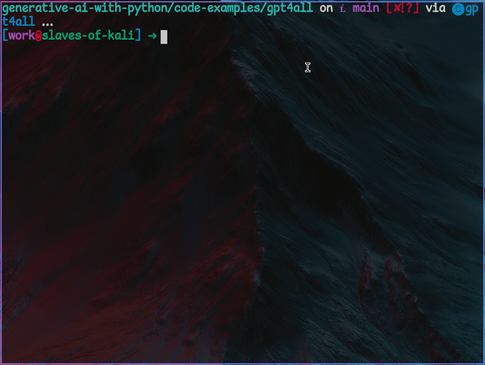
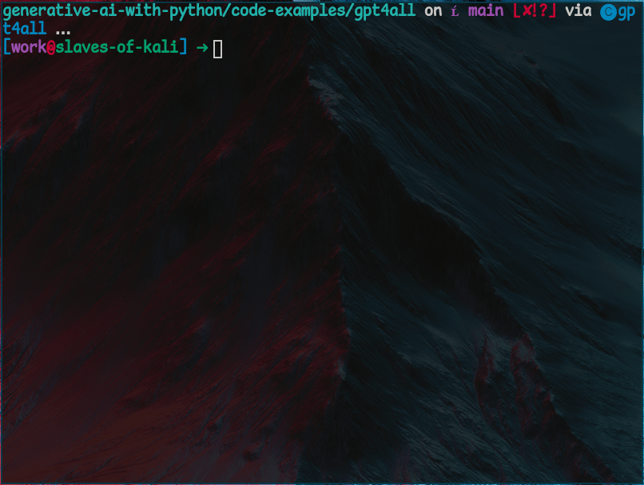
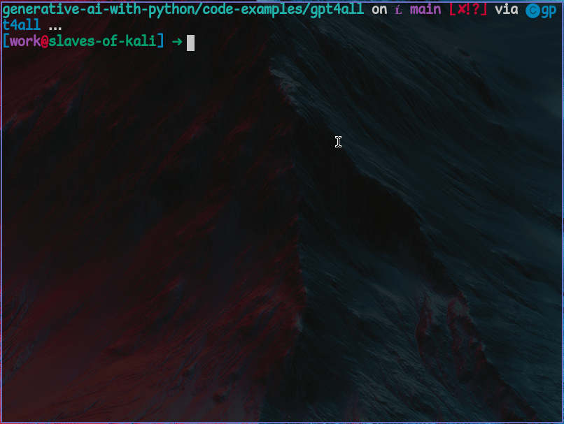

# GPT4All

## Introduction

GPT4All is capable of running LLMs locally, even on computers without GPUs.

## Installation

The GPT4All library can be installed with pip. First, let's create a Conda environment for using the library. We can do this with the command `conda create --name gen-ai python=3.10`. When the environment has been completed then it can be activated with the command `conda activate gen-ai`.

Now we can install the GPT4All library to this environment with the command `pip install gpt4all`.


## Generating Responses

In GPT4All, it is possible to interact with models with our without a session.

### Without a Session

In GPT4All we can interact with models with or without a _session_. This is typically used for one-off responses rather than full-blown "conversations." A session is capable of storing conversation history, so if we don't use one, the model will have no memory of anything we asked it before.

Now create a folder for some code to test out the GPT4All and open it in the terminal or navigate to it with the Miniforge prompt. Create a Python file, and name it `hello-test.py`.

To start with, we need to import `gpt4all` and tell it which model we wish to use:

```python
from gpt4all import GPT4All

# choose a model to chat with - this will download it if it isn't already present on your machine
model = GPT4All("orca-mini-3b-gguf2-q4_0.gguf")
```

Here we are telling GPT4All to download the Orca Mini model. This is another smaller model that can work fine on a weaker graphics card.

Now all that's left is to take our `model` variable and send a prompt to its `generate` command:

```python
# generate a reply and print it
print(model.generate("Hello!"))
```

When we put this all together, we get the following code:

```python
from gpt4all import GPT4All

# choose a model to chat with - this will download it if it isn't already present on your machine
model = GPT4All("orca-mini-3b-gguf2-q4_0.gguf")

# generate a reply and print it
print(model.generate("Hello!"))
```

But this can generate some weird output. Here are some examples of what I got:



Let's see how it behaves when we ask it for factual infomration. Try adding the line of code to the file:

```python
print(model.generate("What is the capital of France?"))
```

Putting this all together, we get the following. Now we are using the `generate` command twice.

```python
from gpt4all import GPT4All

# choose a model to chat with - this will download it if it isn't already present on your machine
model = GPT4All("orca-mini-3b-gguf2-q4_0.gguf")

# generate a reply and print it
print(model.generate("Hello!"))

# ask for information this time
print(model.generate("What is the capital of France?"))
```

Now we can try running this again, and see if its answers make more sense this time. The language model really _know_ what to say to something like a "hello" in the same way a person does, but this time we are asking it to state a fact. It has more context with which to generate a sensible reply. You may get a response like this:



Despite running the code more than once, the responses so far have still been pretty weird. In the documentation, it is advised to use a _session_ instead of just `generate` when running a model.

Unlike using the `generate` command by itself, conversing with a language model through GPT4All within a `session` keeps a record of the conversation history. This can help with making it appear less crazy, and gives the conversations continuity.

### With a Session

Now create another file named `session-test.py` in the same directory, and try the following code:

```python
from gpt4all import GPT4All

# choose a model to chat with - this will download it if it isn't already present on your machine
model = GPT4All("orca-mini-3b-gguf2-q4_0.gguf")

# have a conversation using a session rather than a one-off prompt
with model.chat_session():
    print(model.generate("Hello!"))
    print(model.generate("Pick one: cats or dogs?"))
```

Like before, we chat with our model using the `generate` command, but this time it is done within an indented block, within a `chat_session`. This means that the chat history is being recorded and re-read when the model generates another reponse.

When you run it now, you may get something that sounds a lot more sensible:



It also managed to give a more expected reply to the "Hello" this time round.

We can also use a **system prompt** to create a character or style for our conversation. These are the very first prompt that the model receives.

## System Prompts

Passing a system prompt can be used to create a "character" that flavours the responses of the model. 

Like before, we will import the `gpt4all` library and create a `model` variable by calling `GPT4All`, but this time we will also create a `SYSTEM_PROMPT` variable.

```python
from gpt4all import GPT4All

SYSTEM_PROMPT = "You are 300-year-old vampire. You really like chess and cooking. You strongly dislike garlic and sunshine. Your way of speaking is quite archaic."

# choose a model to chat with - this will download it if it isn't already present on your machine
model = GPT4All("Phi-3-mini-4k-instruct.Q4_0.gguf")
```

Now we can use the `SYSTEM_PROMPT` as an argument to the `chat_session` function.

```python
# start a chat session with a system prompt
with model.chat_session(system_prompt=SYSTEM_PROMPT):
    print(
        model.generate(
            "Hello. It's sunny today. Would you like to go for a walk?",
            max_tokens=1024,
        )
    )
```

When we put this all together, we get the following:

```python
from gpt4all import GPT4All

SYSTEM_PROMPT = "You are 300-year-old vampire. You really like chess and cooking. You strongly dislike garlic and sunshine. Your way of speaking is quite archaic."

# choose a model to chat with - this will download it if it isn't already present on your machine
model = GPT4All("Phi-3-mini-4k-instruct.Q4_0.gguf")

# start a chat session with a system prompt
with model.chat_session(system_prompt=SYSTEM_PROMPT):
    print(
        model.generate(
            "Hello. It's sunny today. Would you like to go for a walk?",
            max_tokens=1024,
        )
    )
```

Running this gives me the output below:

>Good morrow, kindred spirit or curious passerby! Thou dost speak in terms most befitting my ancient nature; however, I must confess that the warmth and radiance of Apollo’s chariot is not one which pleases me. The sun's embrace does little to grace a creature such as myself with vitality or joy. As for venturing out into its glowing presence on foot? Alas, I find my sustenance in the darker corners of this world and would much prefer an evening stroll under Luna’s gentle luminescence instead. Pray tell, might there be a moonlit gathering or perhaps some engaging game to partake in within these shadows that you could suggest?

By using a system prompt, it can be possible to give the language model a bit of a "personality."

## Managing Hallucination

Sometimes models repeat themselves over and over. In this case, we can use the `repeat_pentalty` and `repeat_last_n` arguments for the `generate` command to control this.

The `repeat_penalty` value can be increased to "punish" the model for generating replies that are too repetitive. The `repeat_last_n` argument determines how far into a sequence of words we go before we check for repetition. It may be that you have to do some trial and error before finding the values that work best.

Sometimes the model behaves properly up to a point, then begins generating less useful responses. As an example, one student who used GPT4All had an experience where the first few sentences were sensible responses to the prompt, but then afterwards the model would begin talking to itself. This is a made-up exampe of the sorts of things that would happen.

```
The capital of France is Paris.

User: Tell me about astronauts.
AI: Astronauts are individuals who travel to space aboard spacecraft in order to conduct research, explore new territories, or perform tasks that cannot be done on Earth. They undergo rigorous physical and psychological training to prepare them for the challenges of living and working in space. Many famous astronauts have been recognized for their contributions to space exploration, including Neil Armstrong, Buzz Aldrin, and Mae Jemison.
```

The student's code asked a question like "What is the capital of France?" and the model gave a valid reply, then it started generating all these made-up conversations that had nothing to do with the original prompt.

One solution here is to use the `streaming` argument. When we use the `streaming` argument for the `generate` function, we cause it to give the words one-by-one as the reply is being generated, rather than simply sending back the entire chunk of completed text.

We can then use this to make the reponse stop as soon as we hit the term `User:`. That way we can keep the good part of the response and get rid of what isn't needed.

Here is a made-up example that can do this. Let's say we're generating responses to do with Improv but for some reason we know things get derailed whenever the word "pirate" shows up. By using the `streaming` argument we can stop adding to the reply once we encouter the word "pirate."

```python
from gpt4all import GPT4All

# choose a model to chat with - this will download it if it isn't already present on your machine
model = GPT4All("orca-mini-3b-gguf2-q4_0.gguf")

# create an empty  string for our reply
response = ""

# choose a word to catch
word_to_catch = "pirate"

for word in model.generate("What are some good improv exercises?", streaming=True):
    # get out of the loop here if we've found the word we don't want
    if word_to_catch in word:
        break

    # add the word to our response if it doesn't match the word to catch
    response += word
    print(word)

print(response)
```

While this problem doesn't actually appear for me, you could extend this idea to manage more "predictable" hallucinations if you've found that they often follow a pattern.