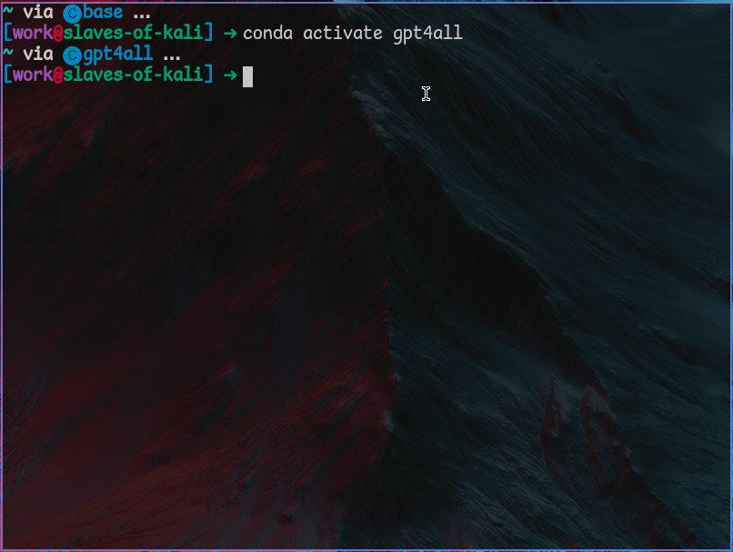

# GPT4All

## Introduction

GPT4All is capable of running LLMs locally, even on computers without GPUs.

## Installation

The GPT4All library can be installed with pip. First, let's create a Conda environment for using the library. We can do this with the command `conda create --name gpt4all python=3.10`. When the environment has been completed then it can be activated with the command `conda activate gpt4all`.

Now we can install the GPT4All library to this environment with the command `pip install gpt4all`.



Now create a folder for some code to test out the library and open it in the terminal or navigate to it with the Miniforge prompt. Create a Python file, and name it `gpt4all-test.py`. Open this file in your text editor/IDE of choice and then enter the following code:

```python
from gpt4all import GPT4All

# choose a model to chat with - this will download it if it isn't already present on your machine
model = GPT4All("orca-mini-3b-gguf2-q4_0.gguf")

# start a chat session
with model.chat_session():
    print(model.generate("Cats or dogs?", max_tokens=1024))
```

Here we are telling GPT4All to download the Orca Mini model, and then asking it to give its thoughts on whether cats or dogs are its favourite pet. This gives me the following output:

