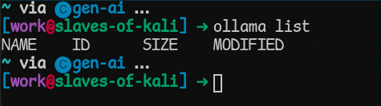

# Ollama

## Introduction

Introduction goes here...

## Installation

Ollama can be downloaded [here](https://ollama.com/download). Please follow the instructions for your system.

When installation is complete, you should be able to enter "ollama" in your Terminal/Command Prompt and see the following:


## Running Ollama in the Terminal

Ollama is now on our system but at the present we can't use it to generate text as there are no models installed. Ollama requires at least one model to do text generation.

We can use the `ollama list` command to see what models are on the system:



To start with, we can download the `dolphin-phi` model by using the following command: `ollama pull dolphin-phi`


After a while, the download will complete, and it becomes possible to chat with the dolphin-phi model. We can do this with the command `ollama run dolphin-phi`. Now I can ask the model some basic questions.


Using the `/exit` command I can leave the conversation. I can then that a model has now been downloaded by running `ollama list` again:


Be aware that these models are typically at least a couple GBs in size, meaning that if you download several of them, they will gradually eat up space on your hard drive. Be sure to remove the models you no longer wish to use. This can be done by entering the command `ollama rm model-to-remove`.

To see a list of available Ollama models, look here: https://ollama.com/search

## Ollama and Python

There are two ways you can talk with Ollama using Python. Start by creating a conda environment and naming it ollama. Open either the terminal or the Miniforge prompt. Create an environment with the command `conda create --name gen-ai python=3.10` and then activate the environment with the command `conda activate gen-ai`.

### `ollama-python`

Ollama has its own [ollama-python](https://github.com/ollama/ollama-python) library. This can be installed with pip.


When the installation finishes, create an `ollama-test.py` file and open it in your text editor/IDE of choice. Now try running the following code:

```python
import ollama

response = ollama.chat(
    model="dolphin-phi",
    messages=[
        {
            "role": "user",
            "content": "Cats or dogs?",
        },
    ],
)
print(response["message"]["content"])
```

In the above example, we are calling the `chat` function. This needs two arguments. First, it needs to know which model we wish to chat with, and then it needs to know what we want to say to the model. This then returns our `response` value, that we will print to see what the model said back to us.

Now run the file. This wil generate a response similar to the one below:


As before, we are still using the dolphin-phi model as it's what's already been installed on the system.

More information on the Python ollama library can be found here: https://github.com/ollama/ollama-python

### `requests`

The `requests` library is also capable of communicating with Ollama models. This one requires a bit more work to get set up, and it's generally easier to use the Ollama library, but if you are using a device like the Nvidia Jetsons then you may have to use the `requests` approach.

First we can check using our terminal/command prompt to see if the Ollama server is running. This can be done with the command `curl http://localhost:11434`


This means we can send API requests to the Ollama server, and use this method of interacting with a model. By default, when Ollama is installed on your system, it should begin running the server at startup.

Now we need to install the requests library. This can be done with `pip install requests`. Make sure that your `gen-ai` environment has been activated before installing so that the library is installed to that environment only, rather than the `base` environment.


To start with, we need to import the requests library, and provide a URL for the Ollama API. This lets the requests library know where to direct the

```python
import requests

OLLAMA_API_URL = "http://localhost:11434/api/generate"
```

Giving a variable name in all-caps is a convention commonly used for *constants*: variables that will have one fixed value throughout the execution of our program. The code would work just the same even if the name was lower-case, but using all-caps serves as a clear signal that this value is not intended to change.

Now we need to assemble the "meat" of our request in the form of a `data` object that stores information about the model we wish to use, the prompt, and whether or not we want our response to be in `stream` mode. This is then sent off to Ollama with the `requests.post` method.

```python
data = {
    "model": "dolphin-phi",
    "prompt": "Cats or dogs?",
    "stream": False,
}
response = requests.post(OLLAMA_API_URL, json=data)
```

The `stream` value can be True or False. It determines if we get our response word-by-word or in one complete chunk. Depending on what you are trying to achieve, you may want to set stream mode to `True` as this can cause things to appear more fluid. However, a bit more coding is required to "handle" the output of steams (like repeatedly updating an interface with every new word that is returned). For the time being, I will keep it as `False`.

Calling `requests.post` then gives us a `response` value, that lets us know if our attempt at communicating with Ollama was successful or not. There can be connection issues that can cause Ollama to fail to generate a reply. To check this, we need to examine the `status_code` attribute of our `response`.

```python
if response.status_code == 200:
    result = response.json()
    print(result["response"])
else:
    print(f"Failed to get a response: {response.status_code}")
```

A `status_code` of 200 let's us know that our communication with Ollama was a success, whereas any other value tells us something went wrong. This is why we use `if-else` to determine what it is we're going to do next. In most cases, you should be fine so long as Ollama is running.

Now we can put it all together to get the following:

```python
import requests

OLLAMA_API_URL = "http://localhost:11434/api/generate"

data = {
    "model": "dolphin-phi",
    "prompt": "Cats or dogs?",
    "stream": False,
}
response = requests.post(OLLAMA_API_URL, json=data)

if response.status_code == 200:
    result = response.json()
    print(result["response"])
else:
    print(f"Failed to get a response: {response.status_code}")
```

Running the code may give you a result like the following:


As we can see, there's been a bit of hallucination. It makes a comparison to dolphins even though we never asked for this. This is likely because the system prompt (the very first prompt the language model receives, that gives it a kind of "identity") informs the language model that its name is dolphin-phi. So that, plus my question about animals, made it act a bit funny. This is often a tricky part of working with such models. If you wish to use LLMs in your project, be sure to put aside enough time to pick up on the "quirks" of the different language models, and potentially experiment with different language models to see which ones give you the best replies within a reasonable amount of time for your hardware. If you can identify a kind of pattern/cause behind (some) hallucinations, then you are better able to take steps to manage them.

## Vision Language Models

Ollama is also capable of using Vision Language Models (VLMs) to analyse pictures. There is a list of vision models here: https://ollama.com/search?c=vision

Moondream is a very small model that can work even on less powerful devices and devices with less space, so let's install that with the command `ollama pull moondream`


Now we can list the models again with `ollama list` and see that moondream is on the system.


Now let's take this clown picture and have moondream describe it:


### `ollama`

Before being able to analyse an image with a VLM, we need to first convert the image into the `base64` format. An example of this is shown below:

```python
import ollama
import base64

# load an image as base64
with open("clown.jpg", "rb") as image_file:
    data = base64.b64encode(image_file.read()).decode("utf-8")
```

The `base64` library does not need to be installed with pip, as it is already part of the Python Standard Library.

Now that the image is in `base64`, it is in a format that our VLM will be able to understand. The Ollama documentation says that images should be passed in a list, with the `images` key-value pair.

```python
response = ollama.chat(
    model="moondream",
    messages=[
        {
            "role": "user",
            "content": "What's in this image?",
            "images": [data], # pass the image in the images field
        },
    ],
)
```

As we are passing just the one image, our list only has one element within it, but more images could be added if we wanted to.

Now we can put this all together...

```python
import ollama
import base64

# load the image as base64
with open("clown.jpg", "rb") as image_file:
    data = base64.b64encode(image_file.read()).decode("utf-8")

response = ollama.chat(
    model="moondream",
    messages=[
        {
            "role": "user",
            "content": "What's in this image?",
            "images": [data], # pass the image in the images field
        },
    ],
)
print(response["message"]["content"])
```

This should give you output along the lines of this:


> The image features a man with a red wig and polka dot suit, wearing white gloves. He is making a funny face for the camera while holding his hands up in front of him. The man's vibrant attire and playful expression make it clear that he is a clown or entertainer.


### `requests`

Now we can do something similar with the requests library. Again, we need to convert our image to base64. We also need to provide the url for our Ollama API.

```python
import requests
import base64

OLLAMA_API_URL = "http://localhost:11434/api/generate"

with open("clown.jpg", "rb") as image_file:
    image = base64.b64encode(image_file.read()).decode("utf-8")
```

Now we can prepare a `data` variable that will store the model to use, the prompt, the image, and whether or not our response should be streamed. This can then be sent to Ollama with the `requests.post` method.

```python
data = {
    "model": "moondream",
    "prompt": "What's in this image?",
    "images": [image],
    "stream": False,
}
response = requests.post(OLLAMA_API_URL, json=data)
```

Now, we can take a look at the response, and print our reply.

```python
if response.status_code == 200:
    result = response.json()
    print(result["response"])
else:
    print(f"Failed to get a response: {response.status_code}")
```

Putting this all together gives the following:

```python
import requests
import base64

OLLAMA_API_URL = "http://localhost:11434/api/generate"

with open("clown.jpg", "rb") as image_file:
    image = base64.b64encode(image_file.read()).decode("utf-8")

data = {
    "model": "moondream",
    "prompt": "What's in this image?",
    "images": [image],
    "stream": False,
}
response = requests.post(OLLAMA_API_URL, json=data)

if response.status_code == 200:
    result = response.json()
    print(result["response"])
else:
    print(f"Failed to get a response: {response.status_code}")
```

This gives me the following output:

>The image features a man with a red wig and polka dot suit, wearing white gloves. He is making a funny face for the camera while holding his hands up to his mouth, creating an amusing scene. The background of the image is plain white, which makes the colorful outfit and the man's expression stand out even more.