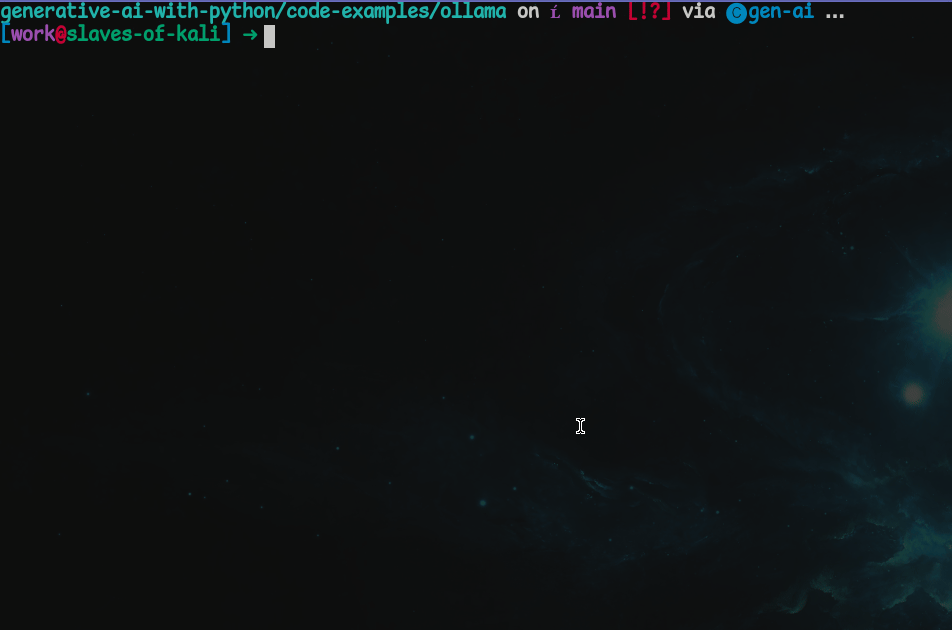
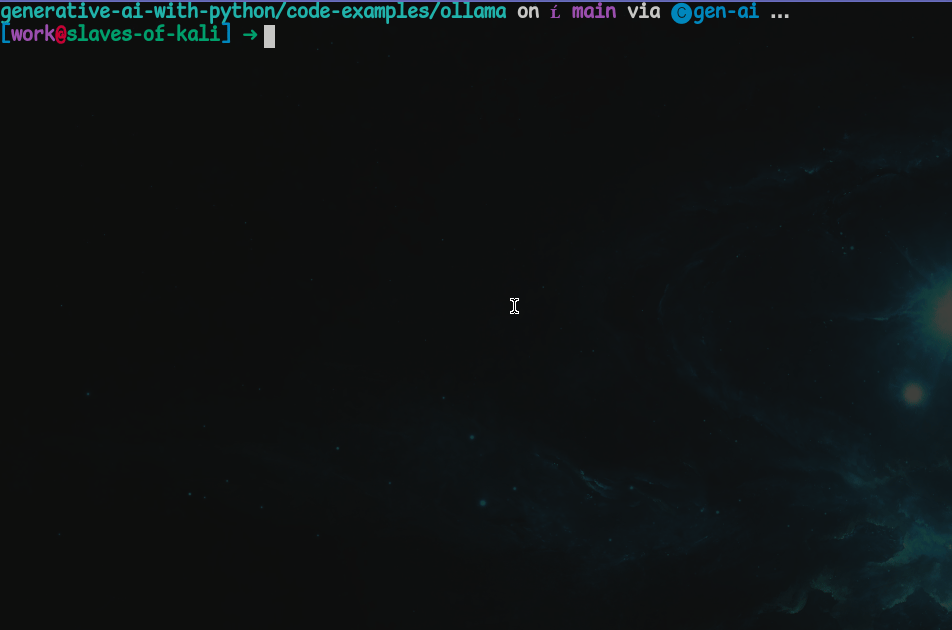
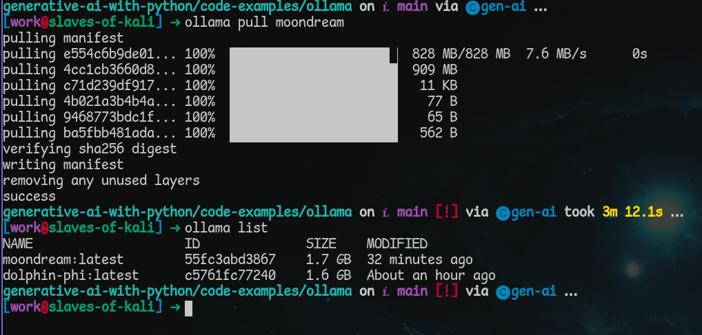

# Ollama

## Introduction

Introduction goes here...

## Installation

Ollama can be downloaded [here](https://ollama.com/download). Please follow the instructions for your system.

When installation is complete, you should be able to enter "ollama" in your Terminal/Command Prompt and see the following:


## Running Ollama in the Terminal

Ollama is now on our system but at the present we can't use it to generate text as there are no models installed. Ollama requires at least one model to do text generation.

We can use the `ollama list` command to see what models are on the system:


To start with, we can download the `dolphin-phi` model by using the following command: `ollama pull dolphin-phi`


After a while, the download will complete, and it becomes possible to chat with the dolphin-phi model. We can do this with the command `ollama run dolphin-phi`.


I can also see that a model has now been downloaded by running `ollama list` again:


Be aware that these models are typically at least a couple GBs in size, meaning that if you download several of them, they will gradually eat up space on your hard drive. Be sure to remove the models you no longer wish to use. This can be done by entering the command `ollama rm model-to-remove`.

To see a list of available Ollama models, look here: https://ollama.com/search

## Ollama and Python

There are two ways you can talk with Ollama using Python. Start by creating a conda environment and naming it ollama. Open either the terminal or the Miniforge prompt. Create an environment with the command `conda create --name ollama python=3.10` and then activate the environment with the command `conda activate ollama`.

### `ollama-python`

Ollama has its own [ollama-python](https://github.com/ollama/ollama-python) library. This can be installed with pip.


When the installation finishes, create an `ollama-test.py` file and open it in your text editor/IDE of choice. Now try running the following code:

```python
import ollama

response = ollama.chat(
    model="dolphin-phi",
    messages=[
        {
            "role": "user",
            "content": "Cats or dogs?",
        },
    ],
)
print(response["message"]["content"])
```

Now run the file. This wil generate a response similar to the one below:


As before, we are still using the dolphin-phi model as it's what's already been installed on the system.

Information on the Python ollama library can be found here: https://github.com/ollama/ollama-python

### `requests`

The `requests` library is also capable of communicating with Ollama models. 

First we can check using our terminal/Command Prompt to see if the Ollama server is running. This can be done with the command `curl http://localhost:11434`


This means we can send API requests to the Ollama server, and use this method of interacting with a model.

To start with, we need to install the requests library. This can be done with `pip install requests`. Make sure that your ollama environment has been activated before installing.



The following code can then also ask the dolphin-phi model if it prefers cats or dogs.

```python
import requests

OLLAMA_API_URL = "http://localhost:11434/api/generate"

data = {
    "model": "dolphin-phi",
    "prompt": "Cats or dogs?",
    "stream": False,
}
response = requests.post(OLLAMA_API_URL, json=data)

if response.status_code == 200:
    result = response.json()
    print(result["response"])
else:
    print(f"Failed to get a response: {response.status_code}")
```

This may give you a result like the following:


As we can see, there's been a bit of hallucination. This is likely because the system prompt informs the language model that its name is dolphin-phi.

## Vision Language Models

Ollama is also capable of using Vision Language Models (VLMs) to analyse pictures. There is a list of vision models here: https://ollama.com/search?c=vision

Moondream is a very small model that can work even on less powerful devices, so let's install that with the command `ollama pull moondream`



Now we can list the models again with `ollama list` and see that moondream is on the system.



Now let's take this clown picture and have moondream describe it:


### `ollama`

Using the code below we can analyse the clown image with the moondream model.

```python
import ollama
import base64

# convert the image to base64
with open("clown.jpg", "rb") as image_file:
    data = base64.b64encode(image_file.read()).decode("utf-8")

response = ollama.chat(
    model="moondream",
    messages=[
        {
            "role": "user",
            "content": "What's in this image?",
            "images": [data], # pass the image in the images field
        },
    ],
)
print(response["message"]["content"])
```

This should give you output along the lines of this:

```
The image features a man with a red wig and polka dot suit, wearing white gloves. He is making a funny face for the camera while holding his hands up in front of him. The man's vibrant attire and playful expression make it clear that he is a clown or entertainer.
```

### `requests`

Now we can do something similar with the requests library.