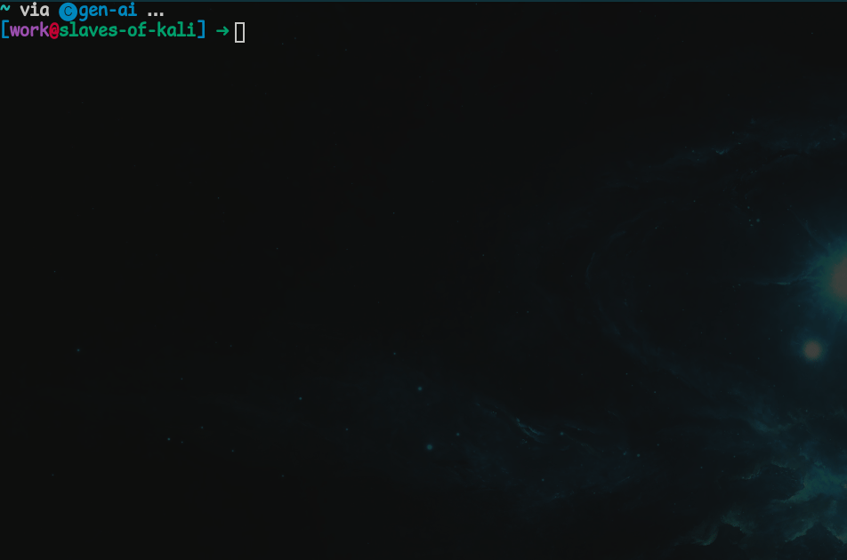
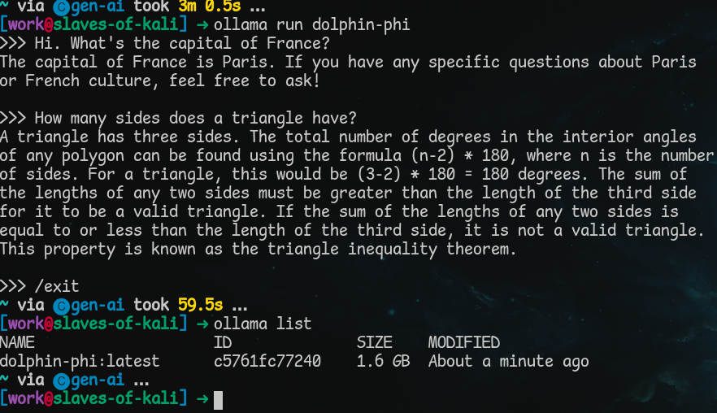

# Ollama

## Introduction

Introduction goes here...

## Installation

Ollama can be downloaded [here](https://ollama.com/download). Please follow the instructions for your system.

When installation is complete, you should be able to enter "ollama" in your Terminal/Command Prompt and see the following:


## Running Ollama in the Terminal

Ollama is now on our system but at the present we can't use it to generate text as there are no models installed. Ollama requires at least one model to do text generation.

We can use the `ollama list` command to see what models are on the system:


To start with, we can download the `dolphin-phi` model by using the following command: `ollama pull dolphin-phi`



After a while, the download will complete, and it becomes possible to chat with the dolphin-phi model. We can do this with the command `ollama run dolphin-phi`.


I can also see that a model has now been downloaded by running `ollama list` again:



Be aware that these models are typically at least a couple GBs in size, meaning that if you download several of them, they will gradually eat up space on your hard drive. Be sure to remove the models you no longer wish to use. This can be done by entering the command `ollama rm model-to-remove`.

## Ollama and Python

There are two ways you can talk with Ollama using Python. Start by creating a conda environment and naming it ollama. Open either the terminal or the Miniforge prompt. Create an environment with the command `conda create --name ollama python=3.10` and then activate the environment with the command `conda activate ollama`.

### `ollama-python`

Ollama has its own [ollama-python](https://github.com/ollama/ollama-python) library. This can be installed with pip.


When the installation finishes, create an `ollama-test.py` file and open it in your text editor/IDE of choice. Now try running the following code:

```python
import ollama

response = ollama.chat(
    model="dolphin-phi",
    messages=[
        {
            "role": "user",
            "content": "Cats or dogs?",
        },
    ],
)
print(response["message"]["content"])
```

Now run the file. This wil generate a response similar to the one below:


As before, we are still using the dolphin-phi model as it's what's already been installed on the system.

### `requests`