# text-generation-webui

## Introduction

text-generation-webui is another tool that allows us to work with language. text-generation-webui also makes it possible to _fine-tune_ existing language models. This enables us to feed a model some chunk of text, and have it absorb knowledge from it, or copy the style of the text we provide.

## Installation and Running

Head over to the text-generation-webui [repo](https://github.com/oobabooga/text-generation-webui) and clone or download it. 

Navigate to the text-generation-webui with the terminal/command prompt and run the start script for your system (Mac, Linux, Windows) by entering `start_windows.bat`, `start_mac.sh` or `start_linux.sh`.

On the first run, some requirements will be installed. This should take a few minutes. Once that is complete, you should see a URL in your terminal to the web UI. THis will most likely be http://127.0.0.1:7860. Open this link in your preferred web browser.

## Web UI Interface

The first thing that you should see upon opening the link is the Chat tab. This is where we can talk to language models via the web interface. We are not restricted to only talking to models through this interface, but it can be used to testing out how much a language model has been "flavoured" by fine-tuning with your custom data.

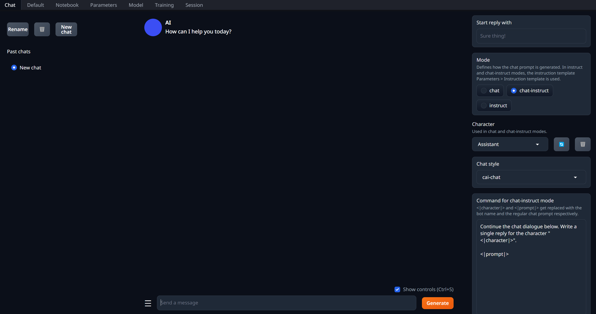

Now try to have a conversation with the assistant? What happens?

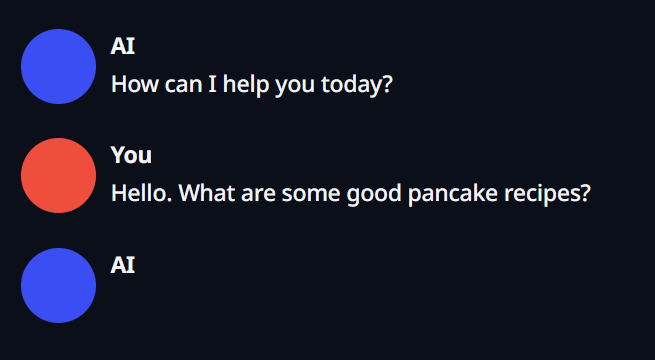

At the moment, asking questions generated an empty "response." Because this is our first time using text-generation-webui, we don't have any models installed yet. So we have nothing to talk to. To fix this, we can head over to the Model tab and download our first model.

The terminal also lets us know that we currently have no Model loaded:

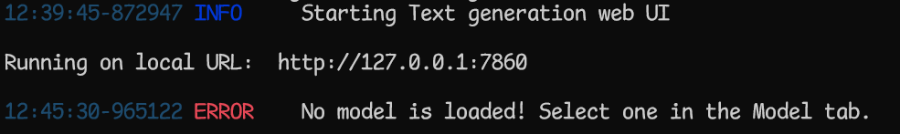

## Downloading a Model

On the top panel, click on the Model tab. 

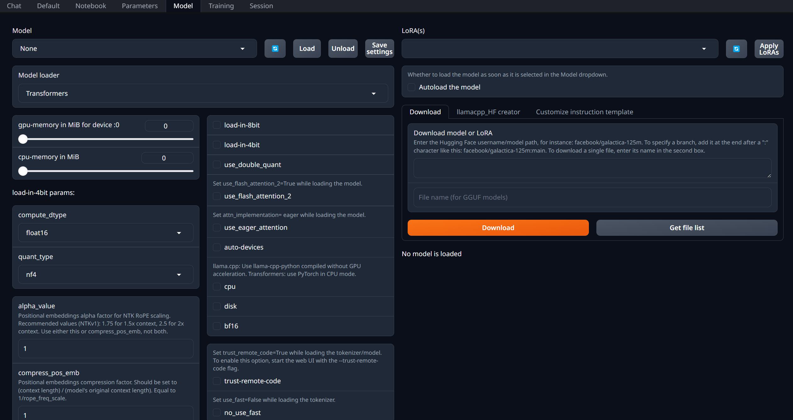

This allows us to download and load models. The helpful thing about text-generation-webui is that we can simply provide a link from [HuggingFace](huggingface.co) and it will download a text generation model for us.

Many have found that [TheBloke's](https://huggingface.co/TheBloke) models work seamlessly within text-generation-webui.

One very lightweight model we can test is [TinyLLama 1.1B](https://huggingface.co/TheBloke/TinyLlama-1.1B-Chat-v0.3-GPTQ). Copy the link to the model on HuggingFace, and then paste it into the text box in the area that says "Download Model or LoRA."

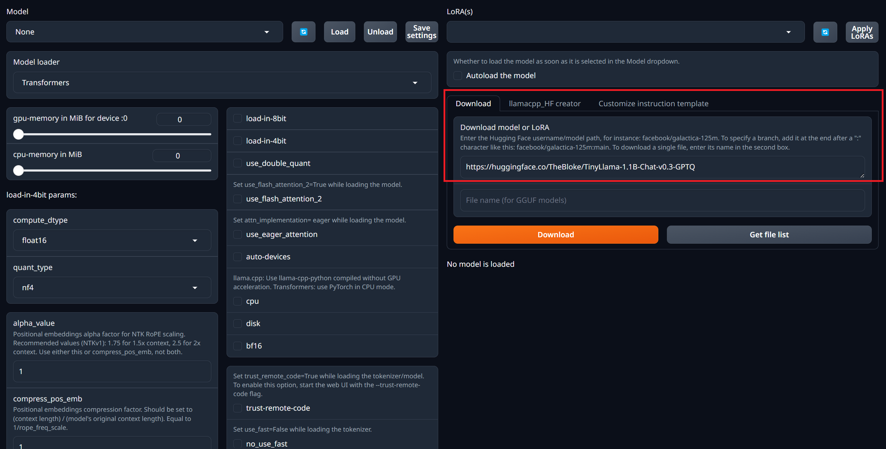

Now hit the orange Download button, and text-generation-webui should begin downloading this model. The terminal will show information about the download progress. As this is a smaller model, it should only take a couple of minutes. When it's done, you should see a download complete message:

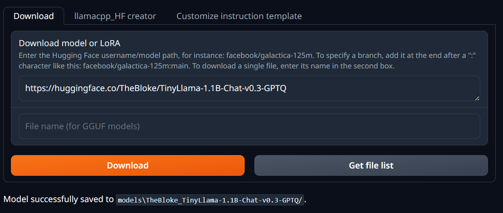

However, we still haven't actually _loaded_ the model yet. To do this, we have to go to the Model drop down menu. 

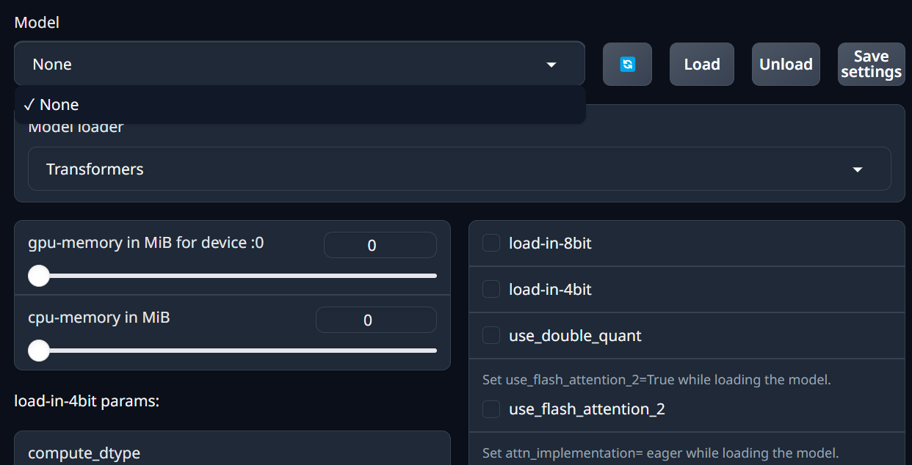

At the moment, we have no Models listed. While the download was a success, we still need to tell text-generation-webui to _refresh_ its list of available models. To do this, press the button with the "repeat" emoji to the right of the drop-down menu. Once that's been done, you should be able to select the newly downloaded model. Now hit load, and text-generation-webui will allow us to use it.

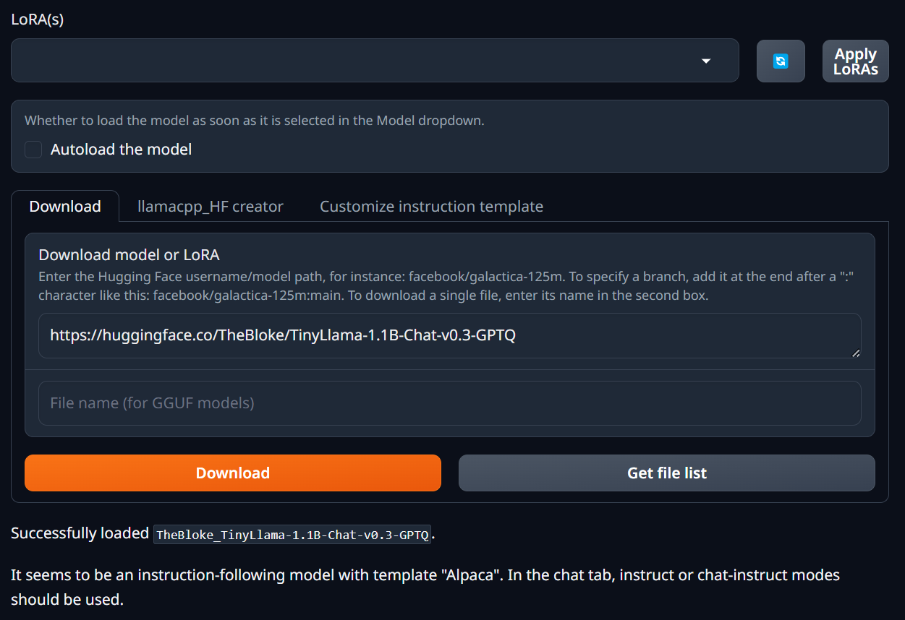

Now we can return to the Chat tab, and try to discuss something with the model. This time, we get a reply.

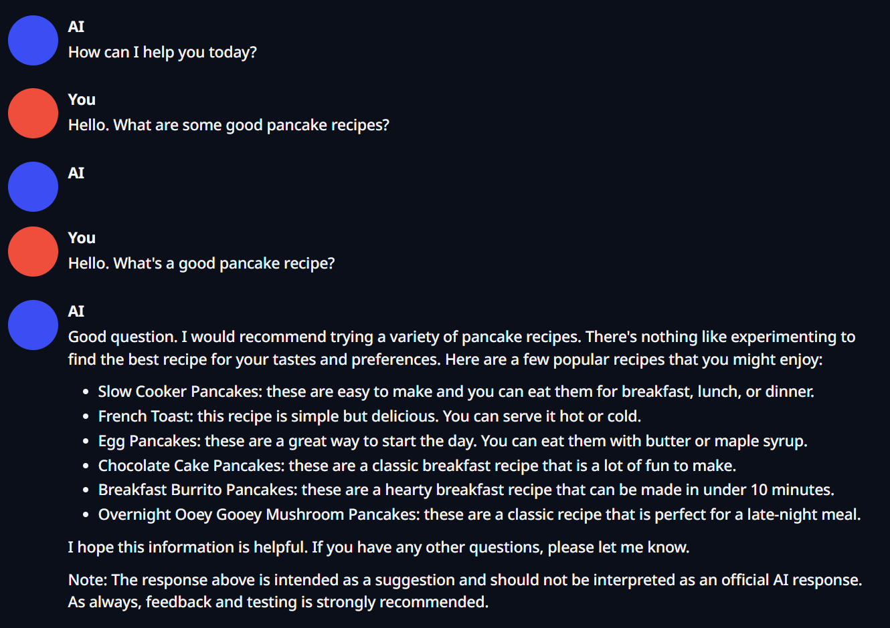

The reply is a bit weird, but it is working.

## Creating Characters

A simple way to flavour responses is to create a character. We can do this by going to the Parameters tab.

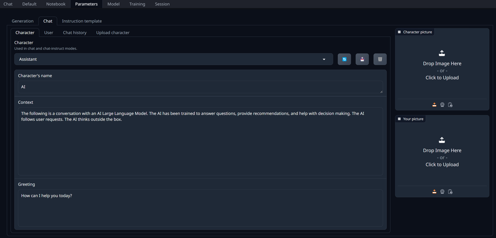

Here we can see the default context for our model. It is simply a standard AI assistant.

Now let's change it into something else...

WIP.

## Fine-Tuning a Model

text-generation-webui makes it possible to fine-tune a model. We can go for style-transfer (causing the model to mimic the writing style of a given text) or knowledge absorption. Style-transfer training is less demanding.

First head over to the Training tab:

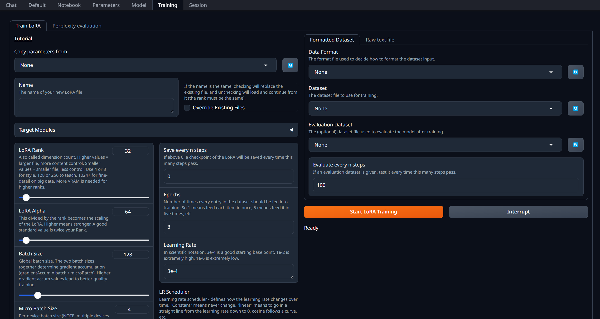

We are able to fine-tune a model with formatted data or a raw text file. Preparing formatted data is a bit more complex, so for now we'll just focus on using raw text files.

On the right hand side, click on the "Raw text file" tab.

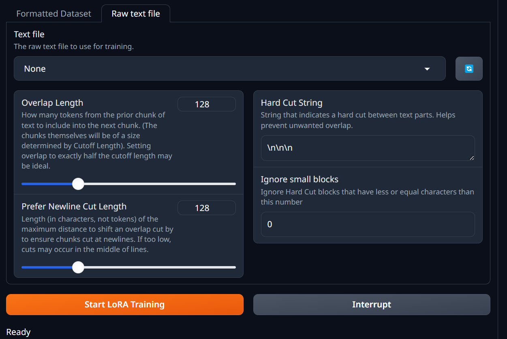

We need to tell text-generation-webui which file it will use for its training. At the moment clicking in the drop-down menu doesn't give us an option to load a file. This is because we need to put something in the "training" folder.

## API